<p align="center">
  
</p>

<h1 align="center">Your agents deserve <i>structural memory</i>.</h1>

<p align="center">
  <a href="docs/">📖 Docs</a> &nbsp;·&nbsp;
  <a href="https://github.com/syncable-dev/memtrace-public/stargazers">⭐ Star us</a> &nbsp;·&nbsp;
  <a href="https://memtrace.io">memtrace.io</a> &nbsp;·&nbsp;
  <a href="https://www.npmjs.com/package/memtrace">npm</a> &nbsp;·&nbsp;
  <a href="https://discord.gg/gzedUSNbna">Discord</a>
</p>

<p align="center">
  Memtrace turns your codebase into a live knowledge graph that AI coding agents can query in milliseconds — every function, class, call edge, and version, across every session, without re-reading files or breaking things they can't see.
</p>

<p align="center">
  <b>Get your fleet on shared structural memory in under 90 seconds.</b>
</p>

<p align="center">
  <b>Structural</b> · zero LLM calls &nbsp;·&nbsp; <b>Bi-temporal</b> · time-travel queries &nbsp;·&nbsp; <b>Replay-aware</b> · zero blind refactors
</p>

<p align="center">
  <a href="https://github.com/syncable-dev/memtrace-public/stargazers"></a>
  <a href="https://www.npmjs.com/package/memtrace"></a>
  
  
  
  
  <a href="https://discord.gg/gzedUSNbna"></a>
  
</p>

---

## What it does

**Three things, every release.**

🧭 &nbsp; **Run a fleet of coding agents on the same repo without merge hell.**
Each agent reads the same call graph, sees the same blast radius, inherits the same temporal history. No collisions. No stale context.

🔁 &nbsp; **Replay any refactor with full causal awareness.**
Agents see exactly what depends on what, and what changed when. No more *"I refactored a function and 14 tests broke that nobody saw."*

⚡ &nbsp; **Index a 50k-file repo in under 90 seconds.**
Rust + Tree-sitter, $0 in API costs, 16 languages, fully local. Your code never leaves your machine.

https://github.com/user-attachments/assets/e7d6a1e9-c912-4e65-a421-bd0256dffa5a

---

## Numbers

| Operation | Memtrace | Best alternative | Δ |
|---|---|---|---|
| Index 1,500 files | **1.5s · $0** | Mem0: 31 min · $10–50 | **~1,200× faster** |
| Exact symbol query (acc@1, lat) | **96.6% · 0.07 ms** | GitNexus: 97.0% · 8.95 ms | 128× lower latency |
| Graph callers recall (Django) | **81.6%** | GitNexus: 5.3% | **15.4×** |
| Incremental re-index p95 | **42.5 ms** | CodeGrapher: 613.7 ms | 14.4× |
| Hybrid acc@1 (Django, 3K cases) | **73.9%** | GitNexus: 38.6% | 1.91× |
| RSS / process | **26 MB** | ChromaDB: 1,060 MB | **41× tighter** |
| Languages | **16+** (Tree-sitter) | varies | — |

Reproducible benchmark suite: [`benchmarks/`](benchmarks/README.md). Same machine, same corpora, same adapter contract. Ground truth from Python's `ast` and `pyright` LSP — never from any tool's own index. **No system gets a home-field advantage in the dataset.**

Detailed breakdowns: [BENCHMARKS-v0.3.22.md](BENCHMARKS-v0.3.22.md) · [BENCHMARKS-v0.3.29.md](BENCHMARKS-v0.3.29.md)

---

## GitHub Star Growth

<a href="https://www.star-history.com/syncable-dev/memtrace-public">
  <picture>
    <source media="(prefers-color-scheme: dark)" srcset="https://api.star-history.com/chart?repos=syncable-dev/memtrace-public&type=date&theme=dark&legend=top-left" />
    <source media="(prefers-color-scheme: light)" srcset="https://api.star-history.com/chart?repos=syncable-dev/memtrace-public&type=date&legend=top-left" />
    
  </picture>
</a>

---

## Get access

Memtrace is in **private beta**. We're rolling out access in batches to keep the feedback loop tight — every cohort lands in a Discord channel where we ship fixes from real bug reports inside a week.

→ **Join the waitlist at [memtrace.io](https://memtrace.io).**

Already have access? `npm install -g memtrace` and you're indexing in 90 seconds. Full setup below.

> 🔒 **Privacy.** Memtrace runs entirely on your machine. Source code never leaves it. The only network traffic is license validation, aggregate node/edge counts, and opt-out crash telemetry — no source, no file paths, no symbol names. Full breakdown: [PRIVACY.md](PRIVACY.md), [TELEMETRY.md](TELEMETRY.md). Disable telemetry with `MEMTRACE_TELEMETRY=off`.

---

## Why Memtrace exists

Good code-intelligence tools already exist. GitNexus and CodeGrapherContext build AST-based graphs that work for *"what's in my repo right now."*

**Memtrace is a bi-temporal episodic structural knowledge graph.** It builds on the same AST foundation and adds two dimensions:

- **Temporal memory** — every symbol carries its full version history. Six scoring algorithms (impact, novelty, recency, directional, compound, overview) let agents ask different temporal questions: *"what changed?"*, *"what's unexpected?"*, *"what'll break?"*.
- **Cross-service API topology** — Memtrace maps HTTP call graphs *between* repositories, detecting which services call which endpoints across your architecture.

On top of that, the structural layer is comprehensive:

| | |
|---|---|
| **Symbols are nodes** | functions, classes, interfaces, types, endpoints |
| **Relationships are edges** | `CALLS`, `IMPLEMENTS`, `IMPORTS`, `EXPORTS`, `CONTAINS` |
| **Community detection** | Louvain algorithm identifies architectural modules automatically |
| **Hybrid retrieval** | Tantivy BM25 + vector embeddings + Reciprocal Rank Fusion + cross-encoder rerank |
| **Rust-native** | compiled binary, no Python/JS runtime overhead, sub-8 ms p95 query latency |

The agent doesn't just search your code. **It remembers it.**

---

## Memtrace vs. general memory systems (Mem0, Graphiti)

Mem0 and Graphiti are strong conversational memory engines designed for tracking entity knowledge (e.g. `User -> Likes -> Apples`). They excel at that. For code intelligence specifically, the tradeoff is that they rely on LLM inference to build their graphs — which adds cost and time when processing thousands of source files.

**Graphiti** processes data through `add_episode()`, which triggers multiple LLM calls per episode — entity extraction, relationship resolution, deduplication. At ~50 episodes/minute ([source](https://github.com/getzep/graphiti)), ingesting 1,500 code files takes **1–2 hours**.

**Mem0** processes data through `client.add()`, which queues async LLM extraction and conflict resolution per memory item ([source](https://mem0.ai)). Bulk ingestion with `infer=True` (default) means every file passes through an LLM pipeline. Throughput is bounded by your LLM provider's rate limits.

**Both** accumulate $10–50+ in API costs for large codebases because every relationship is inferred rather than parsed.

**Memtrace takes a different approach:** it indexes 1,500 files in 1.2–1.8 seconds for $0.00 — no LLM calls, no API costs, no rate limits. Native Tree-sitter AST parsers resolve deterministic symbol references (`CALLS`, `IMPLEMENTS`, `IMPORTS`) locally. The tradeoff is that Memtrace is purpose-built for code — it doesn't handle conversational entity memory the way Mem0 and Graphiti do.

---

## 25+ MCP tools

Memtrace exposes a full structural toolkit via the Model Context Protocol.

<table>
<tr>
<td>

**Search & Discovery**
- `find_code` — hybrid BM25 + semantic + RRF
- `find_symbol` — exact / fuzzy with Levenshtein

**Relationships**
- `analyze_relationships` — callers, callees, hierarchy, imports
- `get_symbol_context` — 360° view in one call

**Impact Analysis**
- `get_impact` — blast radius with risk rating
- `detect_changes` — diff-to-symbols scope mapping

**Code Quality**
- `find_dead_code` — zero-caller detection
- `find_most_complex_functions` — complexity hotspots
- `calculate_cyclomatic_complexity`
- `get_repository_stats`

</td>
<td>

**Temporal Analysis**
- `get_evolution` — 6 scoring modes
- `get_timeline` — full version history
- `detect_changes` — diff-based scope

**Graph Algorithms**
- `find_bridge_symbols` — betweenness centrality
- `find_central_symbols` — PageRank / degree
- `list_communities` — Louvain modules
- `list_processes` / `get_process_flow`

**API Topology**
- `get_api_topology` — cross-repo HTTP graph
- `find_api_endpoints`
- `find_api_calls`

**Indexing & Watch**
- `index_directory` — parse, resolve, embed
- `watch_directory` — live incremental
- `execute_cypher` — direct graph queries

</td>
</tr>
</table>

---

## 17 agent skills

Memtrace ships skills/guidance that teach agents how to use the graph. They fire automatically based on what you ask — no prompt engineering required.

| Skill | You say… |
|---|---|
| `memtrace-search` | "find this function", "where is X defined" |
| `memtrace-relationships` | "who calls this", "show class hierarchy" |
| `memtrace-evolution` | "what changed this week", "how did this evolve" |
| `memtrace-impact` | "what breaks if I change this", "blast radius" |
| `memtrace-quality` | "find dead code", "complexity hotspots" |
| `memtrace-graph` | "show me the architecture", "find bottlenecks" |
| `memtrace-api-topology` | "list API endpoints", "service dependencies" |
| `memtrace-index` | "index this project", "parse this codebase" |
| `memtrace-cochange` | "what else changes with this", "hidden coupling" |

Plus 8 workflow skills that chain multiple tools with decision logic: `memtrace-first`, `codebase-exploration`, `change-impact-analysis`, `incident-investigation`, `refactoring-guide`, `continuous-memory`, `episode-replay`, and `session-continuity`.

---

## Temporal Engine

Six scoring algorithms for different temporal questions:

| Mode | Best for |
|---|---|
| `compound` | General-purpose "what changed?" — weighted blend of impact, novelty, recency |
| `impact` | "What broke?" — ranks by blast radius (`in_degree^0.7 × (1 + out_degree)^0.3`) |
| `novel` | "What's unexpected?" — anomaly detection via surprise scoring |
| `recent` | "What changed near the incident?" — exponential time decay |
| `directional` | "What was added vs removed?" — asymmetric scoring |
| `overview` | Quick module-level summary |

Uses **Structural Significance Budgeting** to surface the minimum set of changes covering ≥80% of total significance.

---

## Compatibility

| Editor / Agent | MCP Tools (25+) | Skills / Guidance | Install |
|---|---|---|---|
| Claude Code | ✅ | ✅ | `npm install -g memtrace` — fully automatic |
| Claude Desktop | ✅ | ✅ | Automatic — shared with Claude Code |
| Cursor (v2.4+) | ✅ | ✅ | `npm install -g memtrace` — fully automatic |
| Codex CLI | ✅ | ✅ | `npm install -g memtrace` — fully automatic |
| Windsurf | ✅ | ✅ | `npm install -g memtrace` — fully automatic |
| VS Code (Copilot) | ✅ | ✅ | `npm install -g memtrace` — fully automatic |
| Hermes | ✅ | ✅ | `npm install -g memtrace` — fully automatic |
| OpenCode | ✅ | ✅ | `npm install -g memtrace` — fully automatic |
| Kiro | ✅ | Steering | `npm install -g memtrace` — fully automatic |
| Cline / Roo Code | ✅ | — | Add MCP server manually |
| Any MCP client | ✅ | — | Add MCP server manually |

Skills are workflow prompts that teach the agent how to chain tools. Kiro does not use `SKILL.md`, so Memtrace writes equivalent auto steering files instead.

---

## Setup

### Claude Code + Claude Desktop

```bash
npm install -g memtrace
```

Handles everything — binary, 17 skills, MCP server, plugin, marketplace. One command, both editors.

For manual setup:

```bash
claude plugin marketplace add https://github.com/syncable-dev/memtrace-public.git
claude plugin install memtrace-skills@memtrace --scope user
claude mcp add memtrace -- memtrace mcp -e MEMTRACE_ARCADEDB_BOLT_URL=bolt://localhost:7687
```

### Cursor

`npm install -g memtrace` handles everything automatically. Cursor v2.4+ reads the same `SKILL.md` format as Claude.

For project-local install (skills travel with your repo):

```bash
npx memtrace-skills install --only cursor --local
```

### Codex, Windsurf, VS Code, Hermes, OpenCode, and Kiro

The installer also writes skills/guidance and MCP configuration for the newer agent surfaces:

| Agent | Global skills / guidance | Global MCP config | Project-local support |
|---|---|---|---|
| Codex | `~/.agents/skills/` | `~/.codex/config.toml` | `.agents/skills/`, `.codex/config.toml` |
| Windsurf | `~/.codeium/windsurf/skills/` | `~/.codeium/windsurf/mcp_config.json` | `.windsurf/skills/`; MCP remains user-level |
| VS Code / Copilot | `~/.copilot/skills/` | VS Code user `mcp.json` | `.github/skills/`, `.vscode/mcp.json` |
| Hermes | `~/.hermes/skills/` | `~/.hermes/config.yaml` | user-level only |
| OpenCode | `~/.config/opencode/skills/` | `~/.config/opencode/opencode.json` | `.opencode/skills/`, `opencode.json` |
| Kiro | `~/.kiro/steering/` | `~/.kiro/settings/mcp.json` | `.kiro/steering/`, `.kiro/settings/mcp.json` |

Install only selected integrations:

```bash
npx memtrace-skills install --only codex,windsurf,vscode,hermes,opencode,kiro
```

Install project-local config where supported:

```bash
npx memtrace-skills install --only codex,vscode,opencode,kiro --local
```

### Other MCP clients

For Cline, Roo Code, or any client that only needs MCP tools, add this server manually:

```json
{
  "mcpServers": {
    "memtrace": {
      "command": "memtrace",
      "args": ["mcp"],
      "env": {
        "MEMTRACE_ARCADEDB_BOLT_URL": "bolt://localhost:7687"
      }
    }
  }
}
```

| Editor | Config file |
|---|---|
| Windsurf | `~/.codeium/windsurf/mcp_config.json` |
| VS Code (Copilot) | `.vscode/mcp.json` in your project root |
| Codex | `~/.codex/config.toml` or `.codex/config.toml` |
| Hermes | `~/.hermes/config.yaml` |
| OpenCode | `~/.config/opencode/opencode.json` or project `opencode.json` |
| Kiro | `~/.kiro/settings/mcp.json` or `.kiro/settings/mcp.json` |
| Cline | Cline MCP settings in the extension panel |

### Uninstall

```bash
memtrace uninstall      # removes skills, MCP server, plugin, settings
npm uninstall -g memtrace
```

Already ran `npm uninstall` first? The cleanup script is at `~/.memtrace/uninstall.js`:

```bash
node ~/.memtrace/uninstall.js
```

### Install troubleshooting

`npm install -g memtrace` ships a small main package + a platform-specific binary (one of `@memtrace/darwin-arm64`, `@memtrace/linux-x64`, `@memtrace/win32-x64`). If `memtrace start` ever says *"Could not find binary for your platform"*:

```bash
# Re-run install, asking npm to keep optional deps
npm install -g memtrace --include=optional

# Or refresh from latest
memtrace install         # built-in self-update
npm install -g memtrace@latest --force

# Or install the platform binary directly (Apple Silicon shown — swap for your platform)
npm install -g @memtrace/darwin-arm64
```

This typically only happens on machines where npm is configured to skip optional dependencies (corporate npmrc, certain CI caches).

---

## Languages

Rust · Go · TypeScript · JavaScript · Python · Java · C · C++ · C# · Swift · Kotlin · Ruby · PHP · Dart · Scala · Perl — and more via Tree-sitter.

---

## Requirements

Memtrace runs locally — first index is CPU/RAM intensive, subsequent queries and incremental indexing are much lighter.

| | Minimum | Recommended |
|---|---|---|
| CPU | 4 cores | 8+ cores for large monorepos |
| Memory | 8 GB RAM | 16–32 GB RAM |
| Disk | 5 GB free | 10–20 GB free |
| GPU | Not required | Not required |
| Node.js | ≥ 18 | Current LTS |
| Git | Required for temporal analysis | Full repo history for best results |

---

## Telemetry

Since v0.3.17 Memtrace ships with **opt-out** telemetry that helps us catch crashes, regressions, and performance issues before someone files an issue.

- **Collected:** app-start events, indexing/embedding durations, panic reports, WARN/ERROR log lines from Memtrace's own crates.
- **NOT collected:** source code, file contents, symbol names, embeddings, repository names or paths, branch names, commit data.
- **Sanitisation:** every payload is run through a sanitiser that strips home-dir paths, token-shaped strings, and email addresses before it touches disk.

Disable with one env var:

```bash
MEMTRACE_TELEMETRY=off memtrace start                    # per-run
export MEMTRACE_TELEMETRY=off                             # permanent (~/.zshrc, ~/.bashrc)
```

Or in your editor's MCP config: `"env": { "MEMTRACE_TELEMETRY": "off" }`.

Full breakdown — including the on-disk queue layout, where data is stored on the receiving end, and how to inspect what would have shipped — is in [TELEMETRY.md](TELEMETRY.md).

---

## License & ownership

**Proprietary EULA.** Free to use during private beta and after general availability for individual developers. Indexer + database (MemDB) are closed-source.

Benchmark suite under MIT in [`benchmarks/`](benchmarks/) — fully reproducible, no proprietary code required to run them.

---

<p align="center">
  <a href="https://memtrace.io">memtrace.io</a> &nbsp;·&nbsp;
  <a href="https://discord.gg/gzedUSNbna">Discord</a> &nbsp;·&nbsp;
  <a href="https://www.npmjs.com/package/memtrace">npm</a> &nbsp;·&nbsp;
  <a href="https://github.com/syncable-dev/memtrace-public/issues">Issues</a>
</p>

<p align="center">
  Built by <a href="https://syncable.dev">Syncable</a> · Copenhagen 🇩🇰
</p>
